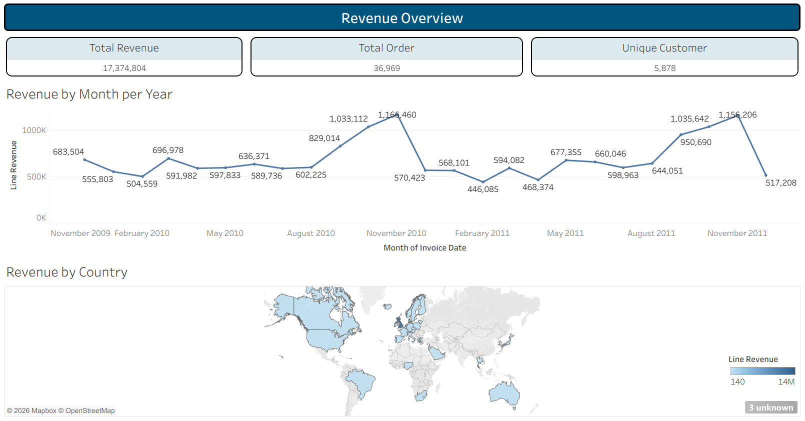
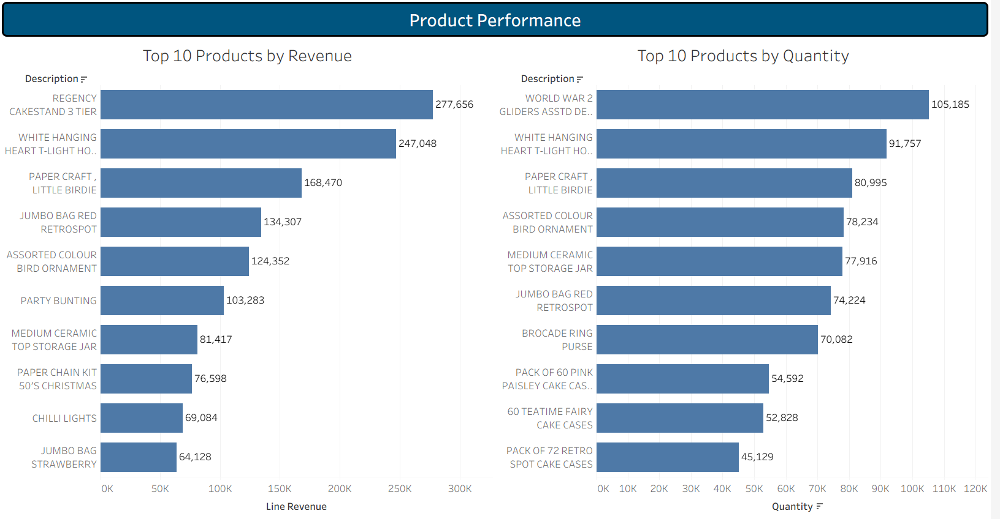
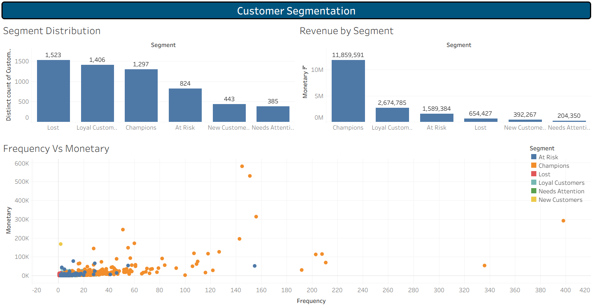
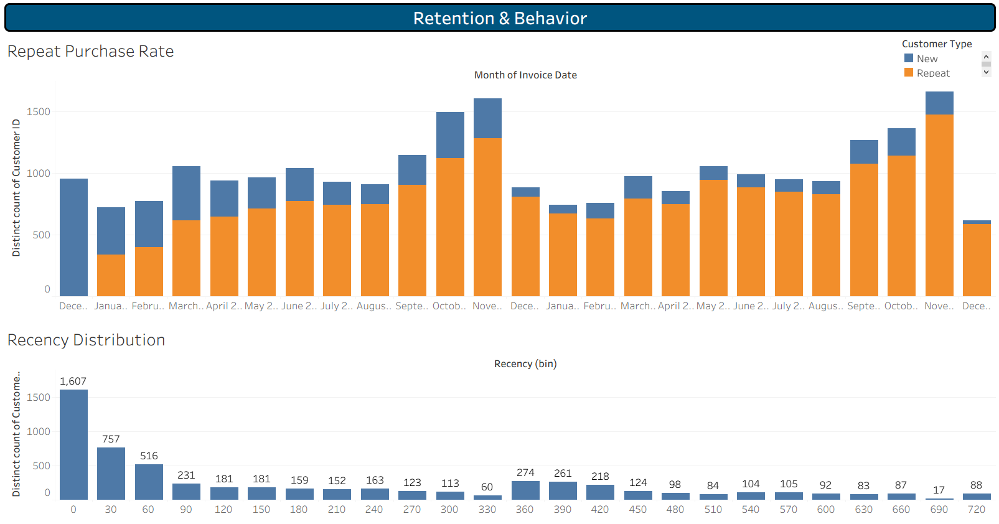

# Online Retail II - RFM Customer Segmentatino Analysis

## Business Question
How is the business performing in terms of sales and customer retention, and which customers should be prioritized for retention efforts based on their purchasing behavior?

**Key questions this analysis answers**

*Sales Performance*
- What is the total revenue, order count, and unique customer count?
- Is there seasonality in monthly sales?
- Which country contributes the most revenue outside the UK?

*Product Performance*
- Which products generate the most revenue vs. the most units sold?

*Customer Segmentation*
- What are the customer segments based on Recency, Frequency, and Monetary (RFM) value?
- What percentage of revenue comes from top-tier customers (Champions)?
- Which customers are at risk of churning?

*Retention & Behavior*
- What is the repeat purchase rate over time?
- How is customer recency distributed?

## Dataset
- Source: Online Retail II Dataset (UCI Machine Learning Repository, via Kaglle)
- Size: 1,067,371 rows, 8 columns (raw)
- Link: https://www.kaggle.com/datasets/mashlyn/online-retail-ii-uci

## Tools 
SQL (SQLite), Python (Pandas), Tableau Public

## Process

**1. Data Cleaning (SQL)**
Loaded raw transactions (CSV) into SQLite. Removed rows with null Customer ID (guest/unlinked orders), cancelled orders (Invoice starting with 'C'), and rows with zero or negative Price/Quantity (internal stock adjustments and postage placeholders). Deduplicated exact duplicate rows. Cleaned dataset: 779,425 rows (73% of raw data retained).

**2. Feature Engineering (Python)**
Converted Invoice Date to datetime, extracted Year and Month, calculated Line Revenue (Quantity × Price) per transaction line.

**3. EDA (Python)**
Analyzed monthly revenue trend, top products by revenue vs. quantity (excluding non-product StockCodes like postage and manual adjustments), revenue by country, and repeat purchase rate over time.

**4. RFM Segmentation (Python)**
Calculated Recency, Frequency, and Monetary value per customer. Scored each dimension into quintiles (1-5) and combined into 6 customer segments: Champions, Loyal Customers, At Risk, Lost, New Customers, and Needs Attention.

**5. Dashboard (Tableau Public)**
Built a 4-page interactive dashboard:

**Page 1 - Revenue Overview :** Total Revenue, Total Orders, Unique Customers (KPIs); Monthly Revenue Trend (line); Revenue by Country (map)

**Page 2 - Product Performance :** Top 10 Products by Revenue vs. Top 10 Products by Quantity (side-by-side comparison)

**Page 3 - Customer Segmentation :** Segment Distribution (customer count); Revenue by Segment; Frequency vs. Monetary scatter plot colored by segment

**Page 4 - Retention & Behavior  :** Repeat Purchase Rate over time (New vs. Repeat customers); Recency Distribution histogram

## RFM Segment Glossary
- **Champion** - Recent, frequency, high-spending customers. Top priority for retention. 
- **Loyal Customers** - Consistent buyers with moderate recency and frequency.
- **At Risk** - Previously valuable customers (high frequency/monetary) who haven't purchased recently. Priority for win-back campaigns.
- **Lost** - Low recency, low frequency. Minimal recent engagement.
- **New Customers** - Recent first-time buyers, low frequency so far.
- **Needs Attention** - Below-average across all RFM dimensions; unclear pattern.

## Key Insights
- Revenue shows clear seasonality, peaking each October-November (pre-holiday ordering) before dropping in December and January.
- **Champions represent 22.1% of customers but generate 68.3% of total revenue** - the single most important segment for retention.
- At Risk customers average nearly the same spend per customer as Loyal Customers (~$1,900), representing meaningful revenue at risk of churn if not re-engaged.
- Lost and Needs Attention combined make up ~30% of customers but only ~5% of revenue - low priority for retention spend.
- Repeat purchase rate climbed from 0% (first month, expected baseline) to a sustained 80-95% by late 2010 onward - most monthly activity comes from returning customers, not new acquisition.
- New customer acquisition declined over time even as repeat rate stayed high, suggesting the business is increasingly dependant on its existing customer base.
- The top-selling product by revenue ("Regency Cakestand 3 Tier") does not appear in the top 10 by quantity, while the top product by quantity ("World War 2 Gliders Asstd Designs") is a low-cost, high-volume item - revenue and volume leaders tell different stories.
- 4 entries with ambigous/non-standard country labels (e.g. "Unspecified", "European Community") were excluded from the geographic visualization but retained in total revenue figures.

## Dashboard Preview

