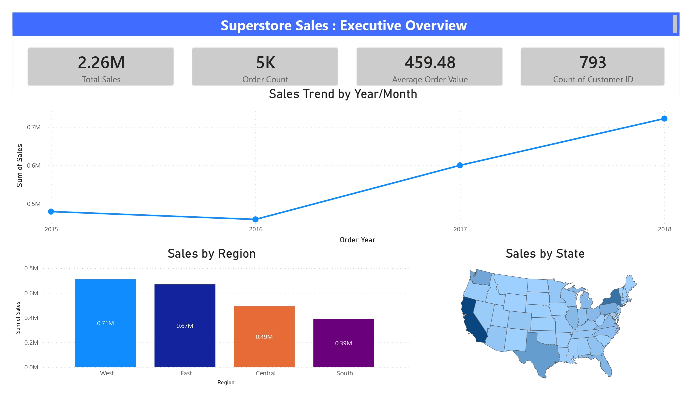
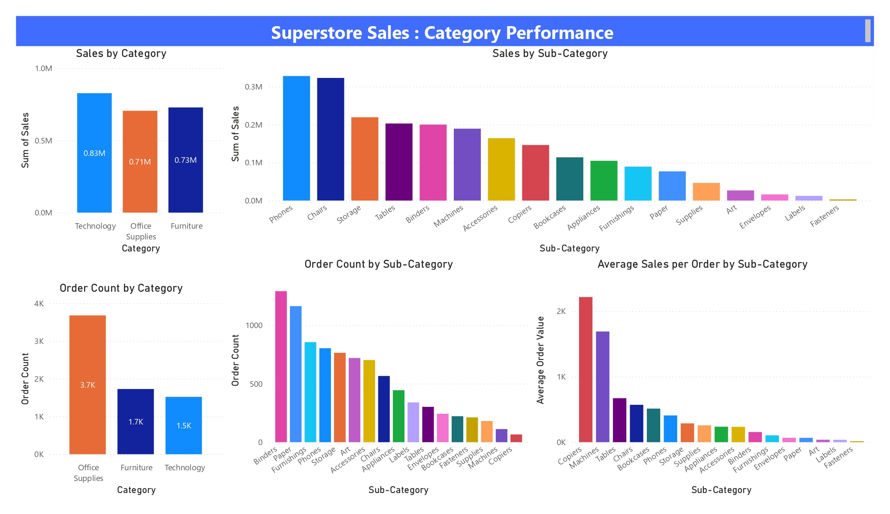
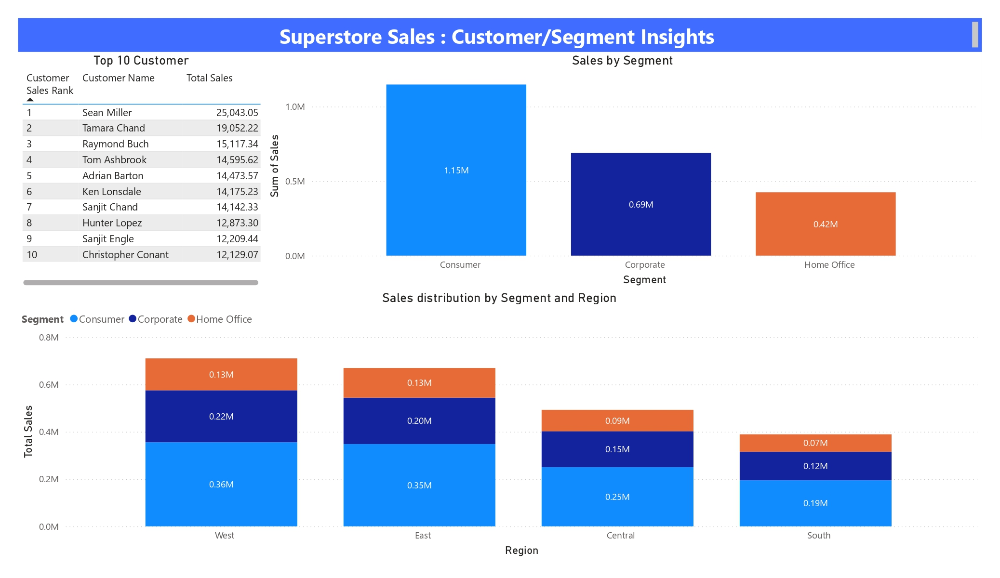
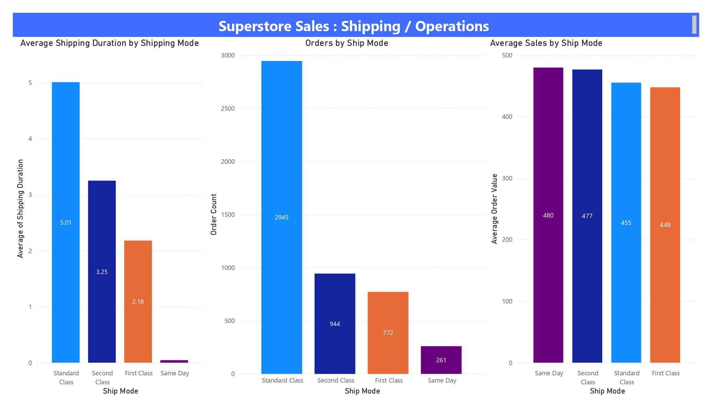

# Superstore Sales Analysis

## Business Question
- How much total sales ? 
- How much the order count ? 
- What the average sales per order ?
- How many customer has order in superstore ?
- is the company sales trend is increase by over the year ?
- which region has the most buy our product ?

- which our product has the most sales ?
- what segment is the most sales ?
- who's the company top ordered ? 

- is our shipping already do what it should do, like shipping mode on same day has no shipping duration day which means 0 and so on
- which shipping mode are used to shipping ?

## Dataset
Source: Superstore Sales Dataset
Size: 2.13 MB
link to Kaggle: https://www.kaggle.com/datasets/rohitsahoo/sales-forecasting

## Tools
Python (Pandas), Power BI

## Process
1. Data Cleaning - fill null values from postal code column with fillna function and changing data type for 'order date' and 'ship date' from object to datetime. feature engineering to extract year and month from order date and add new shipping duration column with ship date subtracted by order date for further analysis.
2. EDA - The dataset consists of 18 columns and 9,800 rows. Each row represents one sold product, and each order is defined by Order ID, not Row ID. Only the Sales column is available for analysis — Profit, Discount, and Revenue are not present in this dataset version.
3. Dashboard
**Page 1 – Executive Overview:** Total Sales, Order Count, AOV, Customer Count (KPIs); Yearly Sales Trend (line); Sales by Region (bar); Sales by State (map)

**Page 2 – Category Performance:** Sales & Order Count by Category/Sub-Category (bar); Average Sales per Order by Sub-Category

**Page 3 – Customer/Segment Insights:** Top 10 Customers (table); Sales by Segment (bar); Sales Distribution by Segment and Region

**Page 4 – Shipping/Operations:** Avg Shipping Duration by Ship Mode; Order Count per Ship Mode; AOV per Ship Mode 

## key insight
- our sales has significant increase at december
- from 2015 to 2018, our sales has significant increase at 50.73%
- technology has the most sales of all category and top of it is phones
- office supplies has the most ordered item and top of it is binder
- west has the most total sales value
- consumer is the most sales value
- shipping mode: Standard Class avg 5 days, Second Class 3 days, First Class 2 days, Same Day 0 days which means on the day ordered
- standard class is the most frequently used shipping mode

## Dashboard Preview

